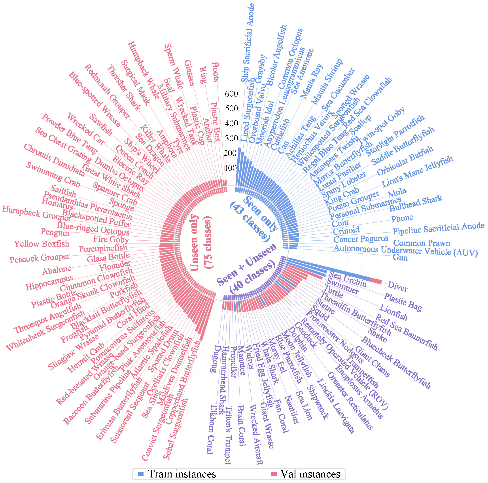
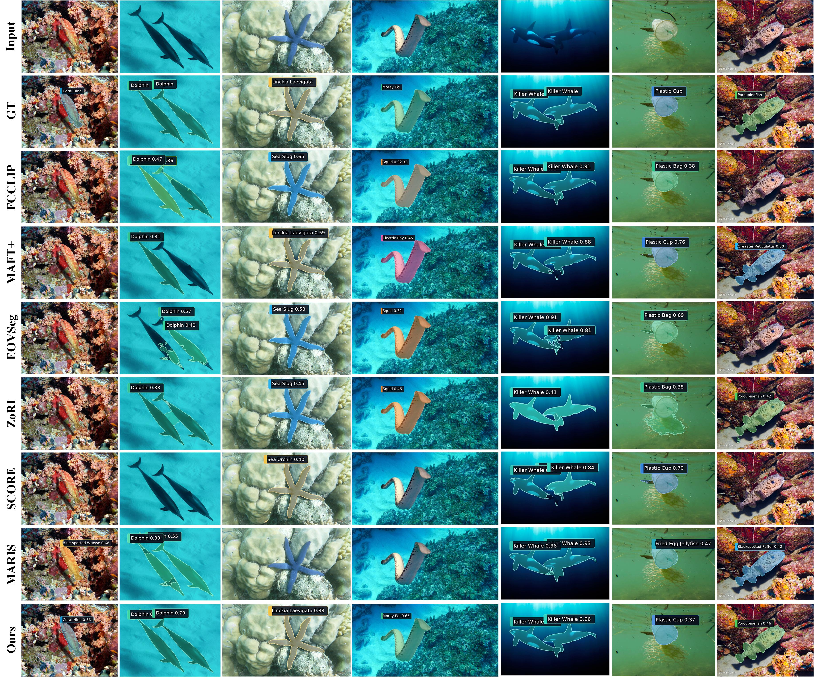

<div align="center">

<h1>Beyond Seen Categories</h1>
<h3>Open-Vocabulary Salient Instance Segmentation for Underwater Scenes</h3>

<br/>

<!-- [](https://arxiv.org/) -->
[](LICENSE)
[](https://python.org)
[](https://pytorch.org)

<br/>

> 💡 **Encountered a bug or have a question?** Feel free to [open an issue](https://github.com/Linzy0227/OV-USIS/issues).

</div>

---

## Overview
We introduce **OV-USIS**, a benchmark for open-vocabulary salient instance segmentation in underwater scenes.



---

## More Visualizations



---

## 🛠 Installation

### 1. Create the environment

```bash
conda env create -f environment_ovs.yml
conda activate ovs
python -m pip install -e detectron2
```

### 2. Compile MSDeformAttn

Make sure `CUDA_HOME` points to your installed CUDA toolkit.

```bash
cd ovusis/modeling/S3B/ops
sh make.sh
cd ../../../..
```

---

## 🚀 Getting Started

### Download pretrained weights

Downloads ConvNeXt-CLIP, DepthAnything V2, and BioCLIP:

```bash
sh download.sh
```

### Prepare the dataset

Download the [images](https://drive.google.com/file/d/14tbW3Ie8MfVjQy9DJKXnFlJ_g-6Z6xcX/view) and [annotations](https://drive.google.com/file/d/1D5sao2j9zQo-3qpfZu4y8fLqOY5vQinr/view?usp=drive_link), then organize them as follows:

```text
dataset/
├── train/
├── val/
└── annotations/
    ├── instances_train.json
    └── instances_val.json
```
### Train

```bash
sh train.sh
```

> Adjust batch size and learning rate in the config when scaling across multiple GPUs.

### Evaluate

```bash
sh test.sh
```

### Compute metrics

After evaluation, copy the result table from the log into the corresponding result file, then run:

```bash
python calculate_metrics_a.py
python calculate_metrics_b.py
```

---

## 🙏 Acknowledgements

We thank the authors of the following excellent works:

- [Mask2Former](https://github.com/facebookresearch/Mask2Former)
- [FC-CLIP](https://github.com/bytedance/fc-clip)
- [MARIS](https://github.com/LiBingyu01/MARIS/tree/main)

---

## 📖 Citation

If OV-USIS helps your research, please consider citing:

```bibtex
@article{ovusis,
  title   = {Beyond Seen Categories: Exploring Open-Vocabulary Salient Instance Segmentation for Underwater Scenes},
  author  = {},
  journal = {},
  year    = {}
}
```
