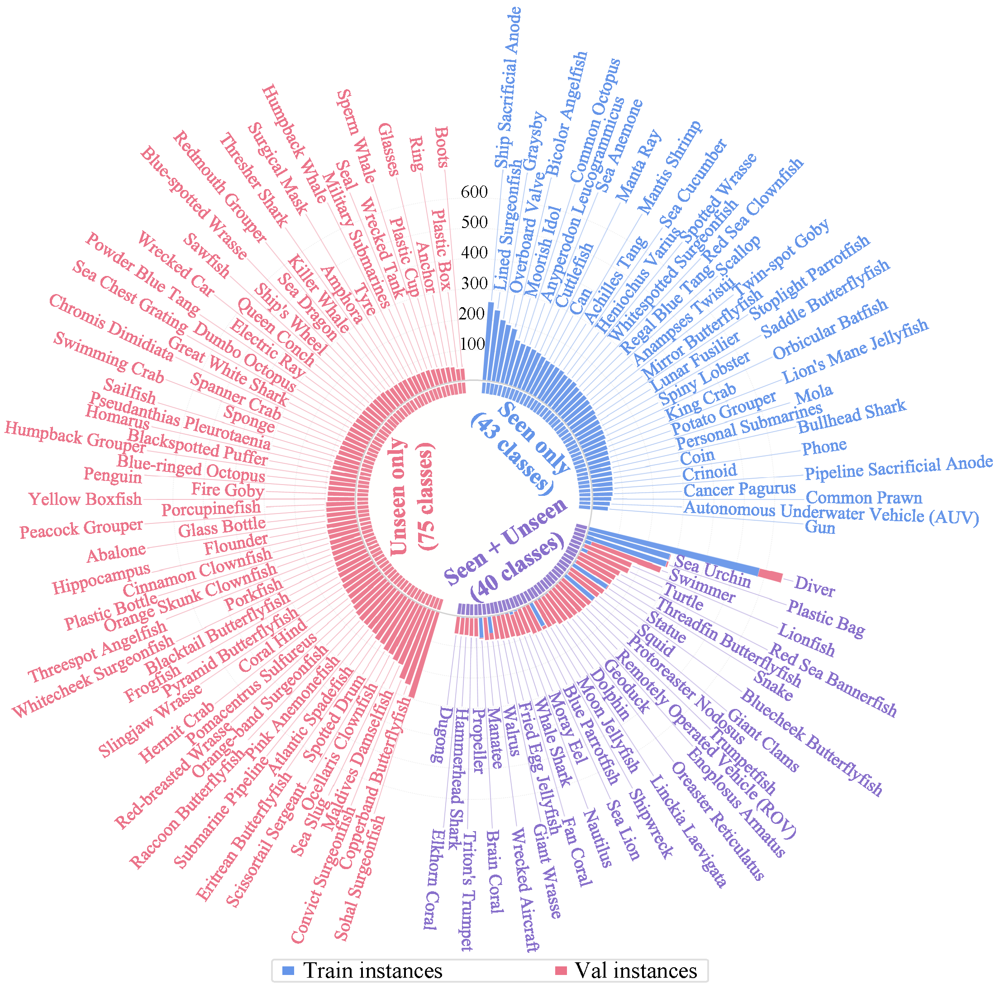
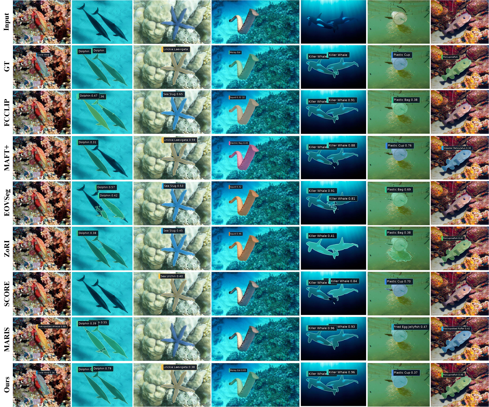

<div align="center">

<h1>Beyond Known Categories</h1>
<h3>Open-Vocabulary Salient Instance Segmentation for Underwater Scenes</h3>

<br/>

<!-- [](https://arxiv.org/) -->
[](LICENSE)
[](https://python.org)
[](https://pytorch.org)

<br/>

> 💡 **Encountered a bug or have a question?** Feel free to [open an issue](https://github.com/Linzy0227/OV-USIS/issues).

</div>

---

## Overview
We introduce **OV-USIS**, a benchmark for open-vocabulary salient instance segmentation in underwater scenes.



---


## More Visualizations



---

## 🛠 Installation

### 1. Create the environment

```bash
conda env create -f environment_ovs.yml
conda activate ovs
python -m pip install --no-build-isolation -e detectron2
```

### 2. Compile MSDeformAttn

Make sure `CUDA_HOME` points to your installed CUDA toolkit.

```bash
cd ovusis/modeling/S3B/ops
sh make.sh
cd ../../../..
```

---

## 🚀 Getting Started

### Download pretrained weights

Downloads ConvNeXt-CLIP, DepthAnything V2, and BioCLIP:

```bash
sh download.sh
```

### Prepare the dataset

Annotations are included under `dataset/annotations/`. Download the [images](https://drive.google.com/file/d/14tbW3Ie8MfVjQy9DJKXnFlJ_g-6Z6xcX/view) and place them in the following directories:


```text
dataset/
├── train/
├── val/
└── annotations/
    ├── instances_train.json
    └── instances_val.json
```

Place the dataset in this project's `dataset/` directory as shown above.

Setting **A** trains on `train` (83 categories) and evaluates on `val` (115
categories). Setting **B** reverses these splits.

### Train

```bash
sh train.sh
```

Edit `train.sh` to choose the GPUs, GPU count, and configuration.

Adjust batch size and learning rate in the config when scaling across multiple
GPUs. See [GETTING_STARTED.md](GETTING_STARTED.md) for all configurations.

### Evaluate

```bash
sh test.sh
```

Edit `test.sh` to choose the GPU, configuration, and checkpoint path.

### Compute metrics

The included `results.txt` contains a per-category segmentation AP table.
Use the matching dataset setting when aggregating it, or replace it with your
own evaluation table and pass its filename with `--results`.

```bash
python calculate_metrics.py --split a --results results.txt
```

Reports AP, AP50, and AP75 for shared, unseen, and all evaluation categories.

---

## 🙏 Acknowledgements

We thank the authors of the following excellent works:

- [Mask2Former](https://github.com/facebookresearch/Mask2Former)
- [FC-CLIP](https://github.com/bytedance/fc-clip)
- [MARIS](https://github.com/LiBingyu01/MARIS/tree/main)

---

## 📖 Citation

If OV-USIS helps your research, please consider citing:

```bibtex
@article{ovusis,
  title   = {Beyond Known Categories: Exploring Open-Vocabulary Salient Instance Segmentation for Underwater Scenes},
  author  = {},
  journal = {},
  year    = {}
}
```
